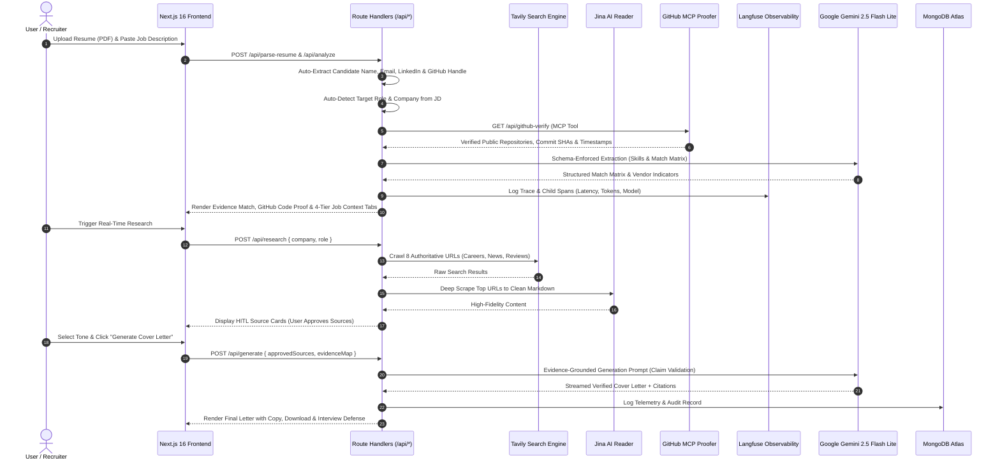

<div align="center">

<!-- Animated Header Banner -->


<br/>

<a href="https://git.io/typing-svg"></a>

<br/>

[](https://career-workspace-ambujsystems.vercel.app/)
[](https://career-workspace-ambujsystems.vercel.app/docs)
[](https://uptimerobot.com/blog/community-spotlight-ambuj-kumar-tripathi/)
[](https://m8ven.ai/mcp/ambuj123-lab/career-workspace-ambujsystems)
[](https://ambuj-ai-portfolio.vercel.app/)

<br/>

[](https://nextjs.org/)
[](https://react.dev/)
[](https://ai.google.dev/)
[](https://openrouter.ai/)
[](https://tavily.com/)
[](https://jina.ai/)
[](https://www.mongodb.com/atlas)
[](https://langfuse.com/)
[](https://github.com/)
[](https://docker.com)
[](https://vercel.com)
[](https://opensource.org/licenses/MIT)

</div>

---

## 🎯 The Engineering Philosophy

### ❌ The "Toy AI Generator" Fallacy
99% of cover letter tools on the internet are simple prompt wrappers that cause immediate disqualification during technical recruiter screens:
- **Hallucinated Metrics:** They invent fake quantitative claims (*"Increased revenue by 43% using Docker"* when the candidate only listed Docker under skills).
- **Fluff & Sycophancy:** They inject generic, embarrassing praise (*"I have long admired your revolutionary, industry-defining synergy"*).
- **Zero Company Grounding:** They have no real-time awareness of recent engineering pivots, active tech stacks, or corporate subsidiaries.
- **Hidden Third-Party Traps:** They fail to detect when a job posting is a third-party staffing/payroll agency disguised as a direct employer.

### ✅ The CoverCraft Architecture: Verifiable Evidence Graph
**CoverCraft is not a template filler. It is an Evidence-Grounded Career Workspace & Claim-Validation Engine designed for senior engineers and discerning hiring teams.**

```
Candidate Resume (PDF)          Job Description (JD)           Live Web (Tavily + Jina AI)
        │                               │                                 │
        ▼                               ▼                                 ▼
┌──────────────────┐           ┌──────────────────┐             ┌────────────────────┐
│ Deterministic    │           │ Deterministic    │             │ 8-Page Multi-Board │
│ Text & Evidence  │           │ Fallback Regex   │             │ Crawl & Markdown   │
│ Extraction Layer │           │ & Vendor Auditor │             │ Deep Extraction    │
└─────────┬────────┘           └────────┬─────────┘             └─────────┬──────────┘
          │                             │                                 │
          └─────────────────────────────┼─────────────────────────────────┘
                                        │
                                        ▼
                        ┌─────────────────────────────────┐
                        │   Human-in-the-Loop Gateway     │
                        │   (Source Approval & Selection) │
                        └───────────────┬─────────────────┘
                                        │
                                        ▼
                        ┌─────────────────────────────────┐
                        │   Evidence-Grounded Generator   │
                        │   • Strict Verbatim Anchors     │
                        │   • Evidence-Grounded Claim Validation │
                        │   • Citation Footnotes [1], [2] │
                        └───────────────┬─────────────────┘
                                        │
                                        ▼
                        ┌─────────────────────────────────┐
                        │   Interview-Defensible Output   │
                        │   (Every claim backed by facts) │
                        └─────────────────────────────────┘
```

---

## ⚡ Core Architectural Pillars

### 1. Multi-Source Real-Time Intelligence & Deep Markdown Crawling
- **Tavily 8-Page Authoritative Crawl:** Queries live enterprise footprints targeting `careers`, `linkedin`, `naukri`, and `ambitionbox`.
- **Jina AI Reader (`r.jina.ai`) Deep Scraping:** Strips HTML clutter, popups, and cookie walls, returning clean, high-fidelity markdown with an exponential timeout fallback.
- **Three-Tier Domain Classifier:** Categorizes incoming intelligence into **Company Official**, **Job Portals & Reviews**, and **External Engineering News**.

### 2. Deterministic Fallback Regex & 4-Tier Company Intelligence
When LLM JSON structures are delayed or partially populated, a deterministic regex pipeline extracts ground truth directly from raw JD tokens:
- **📋 Job Context Sub-Tab (Default):** Extracts Role, Work Model (Remote / Hybrid / On-Site), Experience Band, and Disclosed Salary Status.
- **⚠️ Third-Party / Staffing Detection:** Flags staffing vendors, C2H (Contract-to-Hire), and payroll intermediaries with **verbatim quotes** directly extracted from the JD.
- **🏢 Company Identity Sub-Tab:** Verifies whether the firm is a Direct Employer, Services Vendor, GCC (Global Capability Center), or Product Company. Missing fields strictly report `"Not verified from available sources"`.
- **⚡ Hiring Signals Sub-Tab:** Isolates technology focuses, active initiatives, and recent hiring surges with cited references `[1]`, `[2]`.
- **🔗 Sources Coverage Sub-Tab:** Displays full URL citations and scrape statuses.

### 3. Evidence-Grounded Generation, UX & Claim Validation Policy
- **Evidence-Grounded Synthesizer:** System instructions enforce that **every single achievement claim** in the cover letter must map directly to a verified bullet in the candidate's resume.
- **Interactive In-Line Evidence Markers with Clean Submission Export:** On-screen interactive badges (`[Resume Anchor]` & `[Source Citation]`) allow candidates to hover and verify exact source quotes with a live `[Evidence Markers: ON/OFF]` toggle. When candidates click **Copy to Clipboard** or **Download Markdown/PDF**, internal citation tags are **automatically stripped** to deliver 100% clean, submission-ready letters for recruiters.
- **Adversarial Overclaim Red-Teamer (Veracity Audit Gate):** Scans generated text against candidate resume verbs to catch senior inflation (e.g., resume states "assisted team with Kubernetes rollout" vs draft stating "spearheaded enterprise migration"). The engine automatically softens unverified verbs to authentic baseline evidence and records an audit log.
- **Live Step Progress Tracker & Dynamic Elapsed Timer:** An event-driven 4-phase execution tracker (`01. Competency Match` → `02. MCP Company Research` → `03. Human Approval` → `04. Evidence Synthesis`) with a live counting timer (`00:04s`) and active tool indicator so candidates clearly follow live execution without confusion or perceived stalls.
- **Human-in-the-Loop (HITL) Gate:** Users explicitly inspect, evaluate credibility scores, and toggle on/off scraped web sources before any external intelligence enters the LLM generation prompt.

### 4. Native Model Context Protocol (MCP) Integration (7 Production Tools)

> [!TIP]
> **🛡️ M8ven MCP Trust Index Verified Publisher:**  
> CoverCraft's FastMCP server and its 7 registered tools have been independently audited on the public [M8ven MCP Trust Index](https://m8ven.ai/mcp/ambuj123-lab/career-workspace-ambujsystems) with **0 Security Findings** and verified tool schemas.  
> [](https://m8ven.ai/mcp/ambuj123-lab/career-workspace-ambujsystems)

- Contains a standalone **Anthropic Model Context Protocol (MCP)** server written in Python 3.11 (`mcp-server/`).
- Exposes **7 Registered Tools** via standard Model Context Protocol **stdio transport** and **Streamable HTTP SSE transport**:
  1. `company_research`: Real-time web search via Tavily with traceable source citations.
  2. `evidence_validator`: Claim Ledger validation against source data returning `VERIFIED` / `PARTIAL` / `UNSUPPORTED`.
  3. `jd_analyzer`: Evidence-backed JD matching against resume with actual proof anchors.
  4. `ats_readiness`: Deterministic heuristic audit on keyword coverage, format integrity, and length.
  5. `source_filter`: Algorithmic domain authority tiering, noise suppression, and Outdated News & Stale Tech Filter (<9m company initiatives, <18m engineering stack, [Historical Context] tag).
  6. `cover_letter_generator`: Evidence-grounded synthesis with structured in-line citation markers and zero-overclaim enforcement.
  7. `github_proofer`: Real-time candidate GitHub portfolio & commit history verification engine ($0 free tier PAT, 5,000 req/hr). Inspects public repositories, extracts commit SHAs and messages, and anchors resume technical claims directly into verifiable code evidence with zero overclaiming.
- Dual-transport support: run locally with Claude Desktop/Cursor via `stdio_server` or deploy as an independent streaming microservice using `--transport=sse`.

### 5. Live GitHub Code Proof & Commit Auditor (MCP Tool #7)
- **Verifiable Public Code Evidence:** Connects to candidate GitHub profile via official GitHub MCP tool (`mcp-server/tools/github_proofer.py`) and Next.js route `/api/github-verify`.
- **Commit-Level Hashing:** Extracts real-time commit SHAs (e.g. `sha: 7f2a1b9`), commit messages, repository descriptions, and architecture files to ground technical claims in verifiable code history.
- **Zero-Cost Free Tier:** Powered by a GitHub Personal Access Token (PAT) with read-only public scope, unlocking 5,000 req/hr at **$0 cost** with 100% reliable rate limit isolation.
- **Adversarial Overclaim Sentinel:** If a candidate claims a framework without public repository or commit proof, CoverCraft flags the gap and prompts the applicant for clarification rather than hallucinating fictitious enterprise experience.

### 6. Candidate Privacy-First Architecture & Dual Auto-Extraction Engine
- **PII Hardening & Phone Number Removal:** Mobile phone numbers have been completely removed from the UI and backend schemas to preserve applicant privacy.
- **Dual Intelligent Auto-Extraction:**
  - **Resume Ingestion Auto-Fill (`/api/parse-resume`):** Auto-extracts candidate Name, Email, LinkedIn URL, and GitHub Profile URL from uploaded PDF resumes via regex + LLM extraction, pre-filling the generator form.
  - **Job Description Auto-Detection (`InputForm.jsx`):** Automatically detects target Role and Company Name as soon as a user pastes a Job Description, eliminating redundant manual typing.

### 7. Production Observability: Langfuse LLM Tracing & MongoDB Atlas
- **Langfuse LLM Observability & Tracing:** Full-trace telemetry capturing end-to-end generation latency, prompt/completion token consumption, Gemini model parameters, and span-level child traces across all 7 MCP tool operations.
- **Resilient Non-Blocking Execution:** Observability spans execute in protected async try/catch blocks; if network limits occur, generation continues seamlessly with zero user latency impact.
- **MongoDB Atlas Telemetry:** Logs anonymized generation latency, token volume, tone selections, and error distributions.

### 5. Production Observability & Multi-Stage Containerization
- **MongoDB Atlas Telemetry:** Logs anonymized generation latency, token volume, tone selections, and error distributions.
- **Production Docker Architecture:** Next.js 16 standalone build reduces Docker image size from **1.2 GB to ~120 MB**, running under an unprivileged `nextjs:nodejs` user for zero root vulnerabilities.

---

## 🛠️ Complete Tech Stack

| Layer | Technologies / Services | Purpose |
|---|---|---|
| **Frontend Framework** | **Next.js 16.1.6 (App Router)** + **React 19** | Server Components, Streaming SSR, High-Performance Hydration |
| **Styling & Motion** | **Vanilla Tailwind CSS v4** + HSL Design Tokens | Modern dark mode, frosted glass surfaces, tactile spring micro-interactions |
| **Language Model** | **3-Tier Multi-Provider Cascade**: Primary `gemini-3.5-flash-lite`, Tier 2 `gemini-3.1-flash-lite-preview`, Tier 3 `nvidia/nemotron-3-ultra-550b-a55b:free` (OpenRouter) | Circuit breaker, exponential backoff, zero-downtime resilience |
| **Web Crawling** | **Tavily AI Search API** (8-Page Crawl) | Real-time portal & news search with domain filtering |
| **Page Extractor** | **Jina AI Reader (`r.jina.ai`)** | Deep page markdown conversion with Bearer token authentication |
| **Agent Protocols** | **Anthropic Model Context Protocol (MCP)** | Python 3.11 stdio server for external LLM agent invocation (7 Tools) |
| **Code Verification** | **GitHub REST API & MCP Proofer** | Real-time public commit SHA and repository grounding ($0 Free Tier) |
| **LLM Observability** | **Langfuse Node SDK** | Full-trace latency, token consumption, and multi-agent child spans |
| **Authentication** | **NextAuth.js v4** (Google OAuth 2.0 Provider) | Secure session management & OAuth callback flow |
| **Database & Telemetry**| **MongoDB Atlas** (Mongoose Driver) | Persistent telemetry schema, audit trails, usage tracking |
| **Deployment** | **Vercel Serverless Edge** + **Docker Standalone** | 0-second cold starts, global CDN caching, container portability |

---

## 📐 End-to-End System Sequence



---

## 📂 Project Directory Structure

```text
career-workspace-ambujsystems/
├── web/                             # Next.js 16 Fullstack Application
│   ├── public/                      # Static assets & SVG icons
│   ├── src/
│   │   ├── app/
│   │   │   ├── api/
│   │   │   │   ├── analyze/         # Resume parsing & JD matching handler
│   │   │   │   ├── auth/            # NextAuth Google OAuth endpoints
│   │   │   │   ├── generate/        # Evidence-grounded generation pipeline
│   │   │   │   └── research/        # Tavily 8-page crawl + Jina Reader pipeline
│   │   │   ├── docs/                # Interactive Architectural Documentation
│   │   │   ├── generate/            # Main interactive workspace interface
│   │   │   ├── globals.css          # Design system tokens, tactile spring curves & glow utilities
│   │   │   ├── layout.js            # Root layout with NextAuth Provider
│   │   │   └── page.js              # High-conversion Obsidian Black landing page
│   │   ├── components/
│   │   │   ├── ResultsPanel.jsx     # 4-tier tabbed intel & vendor verification UI
│   │   │   ├── SourceCard.jsx       # Human-in-the-loop approved source cards
│   │   │   └── ...                  # Reusable UI component modules
│   │   ├── lib/
│   │   │   ├── gemini.js            # Resilient Google Gemini client with retry
│   │   │   └── mongodb.js           # Production connection-cached MongoDB client
│   │   └── prompts/                 # Strict system prompts & JSON schemas
│   ├── Dockerfile                   # Multi-stage standalone Next.js container (~120MB)
│   ├── next.config.mjs              # Standalone output configuration
│   └── package.json                 # Dependencies & build scripts
├── mcp-server/                      # Anthropic Model Context Protocol (MCP)
│   ├── server.py                    # Stdio protocol handler with analysis tools
│   ├── Dockerfile                   # Python 3.11-slim container definition
│   └── requirements.txt             # MCP protocol SDK & utilities
├── docker-compose.yml               # Multi-service local orchestrator
└── README.md                        # Production Engineering Specification
```

---

## 🚀 Getting Started Locally

### Prerequisites
- **Node.js**: `v20.x` or `v22.x`
- **Docker & Docker Compose** (Optional, for containerized run)
- **API Keys**: Google Gemini API, Tavily Search API, Jina AI API, MongoDB Atlas URI

### 1. Clone the Repository
```bash
git clone https://github.com/Ambuj123-lab/career-workspace-ambujsystems.git
cd career-workspace-ambujsystems/web
```

### 2. Configure Environment Variables
Create `.env.local` inside the `web/` folder:
```env
# Gemini API Key (Google AI Studio)
GEMINI_API_KEY=your_gemini_api_key

# Tavily AI Search (Real-time web crawl)
TAVILY_API_KEY=your_tavily_api_key

# Jina AI Reader (Markdown extraction)
JINA_API_KEY=your_jina_api_key

# Google OAuth 2.0 Credentials (NextAuth)
GOOGLE_CLIENT_ID=your_google_client_id
GOOGLE_CLIENT_SECRET=your_google_client_secret
NEXTAUTH_URL=http://localhost:3000
NEXTAUTH_SECRET=your_random_secret_32_characters

# MongoDB Atlas Telemetry
MONGODB_URI=mongodb+srv://<user>:<password>@cluster.mongodb.net/?appName=CoverCraft
MONGODB_DB_NAME=covercraft_db
```

### 3. Install Dependencies & Launch
```bash
npm install
npm run dev
```
Open [http://localhost:3000](http://localhost:3000) in your browser.

---

## 🐳 Docker Production Deployment

Build and run the multi-stage standalone container locally:

```bash
# Build multi-stage image (~120MB footprint)
docker build -t covercraft-web:latest ./web

# Run standalone container
docker run -p 3000:3000 --env-file ./web/.env.local covercraft-web:latest
```

Or deploy both the Next.js app and the Python MCP server via Docker Compose:
```bash
docker compose up -d --build
```

---

## 🌐 Production Deployments & Links

| Asset | Link | Status |
|---|---|:---:|
| **🚀 Production App** | [career-workspace-ambujsystems.vercel.app](https://career-workspace-ambujsystems.vercel.app/) |  |
| **📖 Interactive Architecture Docs** | [career-workspace-ambujsystems.vercel.app/docs](https://career-workspace-ambujsystems.vercel.app/docs) |  |
| **💻 GitHub Repository** | [Ambuj123-lab/career-workspace-ambujsystems](https://github.com/Ambuj123-lab/career-workspace-ambujsystems) |  |
| **👤 Engineering Portfolio** | [ambuj-ai-portfolio.vercel.app](https://ambuj-ai-portfolio.vercel.app/) |  |
| **📰 Official UptimeRobot Feature** | [Community Spotlight Article](https://uptimerobot.com/blog/community-spotlight-ambuj-kumar-tripathi/) |  |

---

## 👨‍💻 Architect & Author

<div align="center">

### **Ambuj Kumar Tripathi**
**Generative AI Engineer & Production Systems Specialist**  
*Building production-grade agentic architectures, deterministic extraction pipelines, and high-reliability LLM systems.*

[](https://www.linkedin.com/in/ambuj-kumar-tripathi/)
[](https://github.com/Ambuj123-lab)
[](https://ambuj-ai-portfolio.vercel.app/)
[](mailto:tripathiambuj761@gmail.com)

</div>

### Other Flagship Engineering Projects by Ambuj:
- 🏛️ **[Agentic Financial Parser](https://github.com/Ambuj123-lab/agentic-rag-financial-parser)** — 11-node LangGraph StateGraph financial pipeline with WhatsApp bot & hybrid RAG.
- 🛡️ **[Citizen Safety Awareness AI](https://citizen-safety-ai-assistant.vercel.app/)** — Real-time PII-masked linear RAG assistant for Indian legal & citizen protection.
- ⚖️ **[Constitution of India AI Expert](https://github.com/Ambuj123-lab)** — Resilient Qdrant + Jina AI parent-child chunking legal RAG system.

---

## 📜 License

This project is open-source and licensed under the **[MIT License](LICENSE)**.

<div align="center">


<sub>Architected with ❤️ by Ambuj Kumar Tripathi • Powered by Google Gemini 3.5 & 3-Tier Multi-Provider Cascade (OpenRouter Nemotron 550B) • Langfuse Telemetry • Tavily AI • Jina AI • Next.js 16</sub>

</div>
